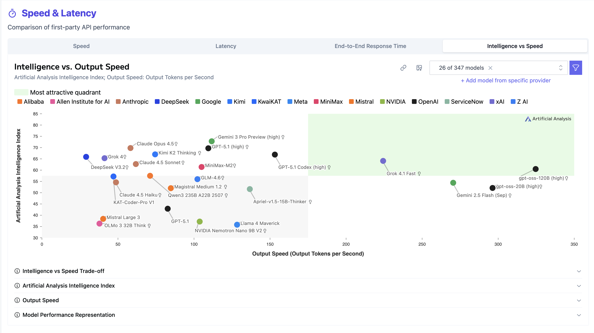

# Building an AI-Powered Startup Search Directory

I built an AI agent that helps VCs and investors search through a database of B2B SaaS startups from 2021-2022. The system supports both explicit search queries like "fintech startups in New York" and higher-order intent queries like "suggest strategic additions to my portfolio based on my prior investments in consumer credit and AI tax software."

## Implementation Journey / Hurdles / Outcomes

I started with a template that had a FastAPI Python server and a Postgres database. The database gets seeded on first run with startup data from a CSV file containing company names, descriptions, websites, locations, and scraped website text.

My first plan was to use:
- **LangGraph SDK** on the FastAPI backend for agent orchestration, mostly because I already used this at work for another project
- **Vercel AI SDK** on the React frontend for the chat interface
- **OpenRouter** for LLM inference (initially Grok 4.1 fast, then Claude Haiku 4.5)

The idea was to use the LangGraph/LangChain adapter that Vercel provides to bridge the two systems. I set up a LangGraph workflow with an agent node and a tool node, built a `search_startups` tool that queries the Postgres database, and tried to stream events back to the frontend.

This turned into a mess. The problems:

1. **Streaming protocol mismatch**: Vercel AI SDK expects a specific streaming format (UI Message Stream with prefixes like `0:"text"` and `d:{"finishReason":"stop"}`). LangGraph streams events in a completely different format.

2. **Message format differences**: The AI SDK 5.x uses a `parts` array structure for messages, while LangGraph/OpenAI expects `content` strings. I had to write adapters to convert between formats.

3. **Tool call event mapping**: LangGraph emits events like `on_tool_start`, `on_tool_end`, `on_chat_model_stream`. Mapping these to the Vercel AI SDK's expected format was error-prone.

4. **Dependency bloat**: I ended up with `langgraph`, `langchain-openai`, `langchain-core`, and `sse-starlette` just to orchestrate a single tool call loop.

After hitting multiple 422 errors, model ID issues, and streaming bugs, I stepped back and asked: do I really need LangGraph for this?

The answer was no. My use case is straightforward:
1. User sends a message
2. LLM decides to call a tool (or not)
3. If tool called, execute it and feed results back to LLM
4. LLM generates final response
5. Stream it to the user

This is just a tool-calling loop. The OpenAI Python SDK handles this natively.

So I ripped out LangGraph entirely and rewrote the backend with just the `openai` package:

```python
# The entire agent is now ~100 lines in chat.py
client = AsyncOpenAI(
    api_key=os.getenv("OPENROUTER_API_KEY"),
    base_url="https://openrouter.ai/api/v1",
)

async def run_agent(messages):
    while True:
        response = await client.chat.completions.create(
            model="anthropic/claude-haiku-4.5",
            messages=openai_messages,
            tools=[SEARCH_TOOL],
            stream=True,
        )
        # ... handle streaming, tool calls, loop back if needed
```

On the frontend, instead of fighting with `useChat` and custom transports, I just used `fetch` with a `ReadableStream`:

```typescript
const response = await fetch("/api/chat", { ... });
const reader = response.body?.getReader();
while (true) {
    const { done, value } = await reader.read();
    // accumulate and update state
}
```

I still use the AI Elements components (`Conversation`, `Message`, `PromptInput`) for the UI because they look good and handle markdown rendering via Streamdown. But the actual streaming logic is plain fetch.

For the LLM model, I initially used Claude 4.5 Haiku which has impressive performance for (1) being a cost efficient model and (2) for being a fairly low latency model. However, Claude 4.5 Sonnet still kind of blows 4.5 Haiku out of the water for intelligence (almost 10 point difference on the AAII benchmark). Because our customer is a VC, I feel that this investment in a more intelligent model (while slightly increasing latency) is a worthwhile cost. With some testing, I found the results of 4.5 Sonnet to be more comprehensive and sensible when asking more obscure questions that require some sort of reasoning.



## Final Implementation

### Tech Stack

- **Backend**: FastAPI + OpenAI Python SDK + PostgreSQL + SQLAlchemy
- **Frontend**: React + Vite + Tailwind CSS + AI Elements
- **LLM**: Claude Sonnet 4.5 via OpenRouter
- **Streaming**: Plain text streaming (no complex protocol)

### search_startups tool

The LLM has access to one tool: `search_startups`. It takes:
- `keywords`: List of search terms to match against company names, descriptions, and website text
- `city`: Optional city filter
- `limit`: Max results (default 10)

The tool uses SQLAlchemy with `ILIKE` patterns for fuzzy matching:

```python
for kw in keywords:
    pattern = f"%{kw}%"
    keyword_conditions.append(
        or_(
            Company.company_name.ilike(pattern),
            Company.description.ilike(pattern),
            Company.website_text.ilike(pattern)
        )
    )
```

### How It Caters to the VC Use Case

**1. Explicit Search Queries**

When a VC types "fintech startups in New York", the LLM extracts relevant keywords (`fintech`, `finance`, `banking`) and the city filter, calls the tool, and returns matching results.

**2. Higher-Order Intent Queries**

This is where it gets interesting. When a VC says "My prior investments include a consumer credit building app and AI tax prep software. Suggest some strategic additions to my portfolio", the LLM:
- Thinks about what industries relate to those investments
- Identifies adjacent markets (healthcare billing, payment infrastructure, financial automation)
- Makes multiple tool calls with different keyword combinations
- Synthesizes results with strategic justifications

**3. Justification Column**

Every search result includes a "Justification" column explaining why that startup was chosen for the specific query. This is crucial for VCs who need to quickly evaluate fit without reading every description.

**4. Markdown Table Output**

Results come back as a clean markdown table with Company Name, Description, Website, Location, and Justification columns. The Streamdown component renders this nicely in the UI.

### UI/UX Decisions

- **Landing page → Chat transition**: Users start with a clean search input. After the first query, it transitions to a chat interface for follow-ups.
- **Search status indicators**: During tool calls, users see `🔍 Searching database for: keywords...` so they know what's happening.
- **Dark user message bubbles**: User messages have a dark background to visually distinguish them from assistant responses.
- **Streaming**: Responses stream in token-by-token so users see progress immediately.

## Lessons Learned

1. **Don't over-engineer**: LangGraph is powerful for complex multi-agent workflows, but for a single-tool agent, the OpenAI SDK's native tool calling is simpler and works great.

2. **Protocol mismatches are painful**: When your frontend SDK expects a specific streaming format and your backend uses a different one, you'll spend more time on adapters than on actual features.

3. **Start simple, add complexity later**: I could always add LangGraph back if I needed features like checkpointing, human-in-the-loop, or multi-agent orchestration. But for an MVP, vanilla tool calling is enough.

4. **AI Elements components are nice**: Even though I ditched the `useChat` hook, the UI components from AI Elements (Conversation, Message, PromptInput) saved a lot of time on styling and markdown rendering.

## What I'd Do Next

1. **Better search**: The current `ILIKE` search is basic. Could add full-text search with `pg_trgm` or integrate a vector database for semantic search.

2. **Conversation memory**: Right now each query includes the full message history. For longer conversations, I'd add summarization or a sliding window.

3. **More tools**: Add tools for filtering by funding stage, founding year, or team size. Let the LLM decide which filters to apply.

4. **Caching**: Cache common queries to reduce LLM calls and latency.